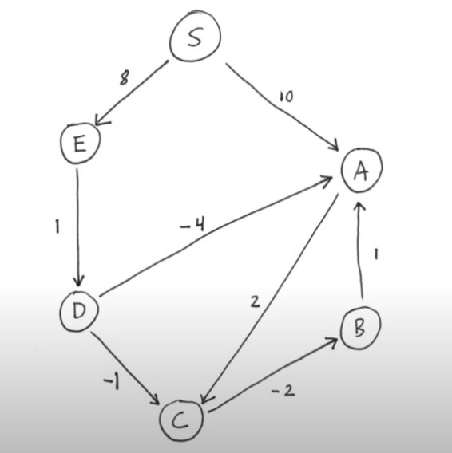

# Semestrální prace PJC - hledání nejkratších cest v grafu

V této semestrální práci jsem se zabýval vytvořením konzolové aplikace, která umožní uživateli na základě zadaného grafu najít nejkratší cesty jak z bodu X do ostatních bodů v grafu.
V této verzi aplikace jsou implementovány dva algoritmy Dijkstrův a Bellman-Fordův. Dijkstrův lze využit pouze na grafy s nezáporně ohodnocenými hranami, kdežto Bellman-Fordův můžeme využit i na tyto grafy ale v porovnání s Dijkstrovým algortimem je pomalejší. Tato zpráva byla napsána ke commitu:**c6e98d06c136dba2af3119b17fcb8a6a9c4b8c09**

### Popis zadání

Zadáním bylo napsat aplikaci v jazyce C++ hledající nejkratší cesty v grafu

### Použití aplikace
Aplikace umožňuje využít několik přepínačů, aby aplikace provedla přesně to co chceme, jediný přepínač **-f** je povinný

*  --help &emsp; zobrazí nápovědu programu 
*  -s &emsp; určí vrchol ze kterého se cesty mají počítat (pokud tento přepínač nebude využit, cesta se spočítá ze všech vrcholů)
*  **-f** &emsp; **cesta k souboru s grafem se kterým chceme pracovat**
*  -w &emsp; cesta k souboru do kterého chceme uložit výsledek programu
*  -t &emsp; změří jak dlouho se výpočet cesty prováděl
*  -a &emsp; název algoritmu, který, chceme cestu/y spočítat ( bez specifikace se použije bellman-fordův algoritmus)

### Ukázka použití aplikace

Mějme tento graf:



Tento graf přepíšeme do formátu který podporuje tato aplikace tudíž:

S:A=10,E=8\
A:C=2\
B:A=1\
C:B=-2\
D:A=-4,C=-1\
E:D=1


neboli odkud:kam=délka cesty, kde čárka odděluje cíle cest. To uložíme do souboru s koncovkou txt.
Zkompilovaný program, zde semestral spustíme pomocí příkazu:

./semestral -f ../input.txt -a B -s S

Kde jako vstup bereme soubor input.txt, jako algoritmus používáme bellman-forda a jako startovní bod jsme vybrali vrchol S.\
Tento příkaz nám poté vrátí výsledek:
```
This results were calculated using: Bellman-Ford algorithm

Shortest path from vertex: S
| S | 0 | S
| A | 5 | A -> D -> E -> S
| B | 5 | B -> C -> A -> D -> E -> S
| C | 7 | C -> A -> D -> E -> S
| D | 9 | D -> E -> S
| E | 8 | E -> S
```

Ve složce **graphs** najdete dva testovací grafy.